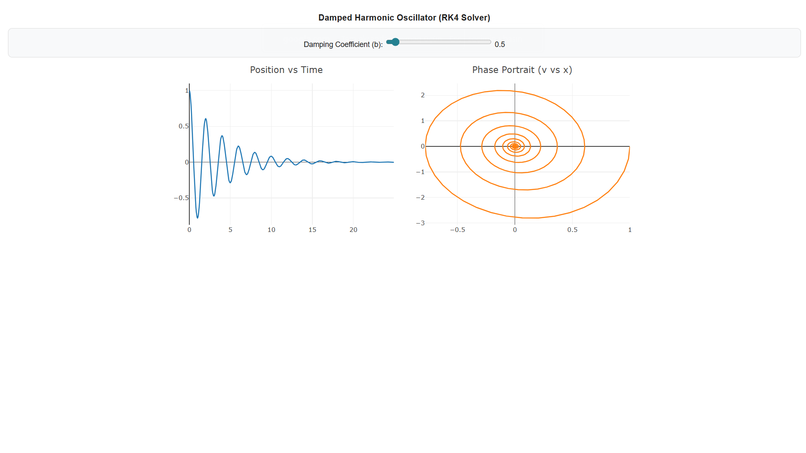

# Solutions: Section 3 - Waves

### 1. Wave Properties
The wave speed is given by the formula $v = f \lambda$.
- **In Air:** $\lambda = \frac{v}{f} = \frac{343 \text{ m/s}}{440 \text{ Hz}} \approx 0.78 \text{ m}$
- **In Water:** $\lambda = \frac{v}{f} = \frac{1482 \text{ m/s}}{440 \text{ Hz}} \approx 3.37 \text{ m}$

---

### 2. String Harmonics
For the fundamental frequency ($n = 1$), the length of the string is half a wavelength: $L = \frac{\lambda}{2}$.
- $\lambda = 2 \cdot L = 2 \cdot 0.64 \text{ m} = 1.28 \text{ m}$
- $v = f \lambda = 330 \text{ Hz} \cdot 1.28 \text{ m} = 422.4 \text{ m/s}$

---

### 3. Superposition Principle
Given $y_1 = A \sin(kx - \omega t)$ and $y_2 = A \sin(kx + \omega t)$.
Using the identity $\sin(A-B) + \sin(A+B) = 2 \sin(A) \cos(B)$:
- **Resulting Wave:** $y(x,t) = 2A \sin(kx) \cos(\omega t)$
- **Nodes:** Occur where $\sin(kx) = 0$, which means $kx = n\pi$.
- **Node Positions:** $x = \frac{n\pi}{k}$ for $n = 0, 1, 2, ...$

---

### 4. Phase Difference
Phase difference $\Delta \phi$ is calculated as:
$\Delta \phi = \frac{2\pi}{\lambda} \cdot \Delta x$
- Given $\Delta x = \frac{\lambda}{3}$:
- $\Delta \phi = \frac{2\pi}{\lambda} \cdot \frac{\lambda}{3} = \frac{2\pi}{3} \text{ rad}$

---

### 5. Echo Ranging
The sound travels to the cliff and back ($2d$).
- $2d = v \cdot t$
- $d = \frac{343 \text{ m/s} \cdot 1 \text{ s}}{2} = 171.5 \text{ m}$

---

### 6. Wave Equation
Given $y(x,t) = 0.05 \sin(2\pi x - 50\pi t)$:
- **Amplitude:** $A = 0.05 \text{ m}$
- **Wavelength:** $k = 2\pi \Rightarrow \lambda = \frac{2\pi}{k} = 1 \text{ m}$
- **Frequency:** $\omega = 50\pi \Rightarrow f = \frac{\omega}{2\pi} = 25 \text{ Hz}$
- **Speed:** $v = f \lambda = 25 \text{ m/s}$

---

### 7. Standing Wave Modes
For 4 antinodes on a string fixed at both ends, $L = 2\lambda$:
- $0.80 \text{ m} = 2\lambda$
- $\lambda = 0.40 \text{ m}$

---

### 8. Traveling Waves
A traveling wave must satisfy $y(x,t) = f(x \pm vt)$.
- **a)** $A \cos(kx^2 - \omega t)$: **No** (nonlinear in $x$).
- **b)** $A(x - vt)^2$: **Yes** (matches form $f(x-vt)$).
- **c)** $A \log(x + vt)$: **Yes** (matches form $f(x+vt)$).

### 9. Damped oscillator

### 9. Damped Harmonic Oscillator

The motion of a damped system depends on the relationship between the damping coefficient $b$ and the natural frequency of the system $\omega_0$. The equation of motion is given by:

$$m \frac{d^2x}{dt^2} + b \frac{dx}{dt} + kx = 0$$

Based on the uploaded graph, there are three distinct damping regimes:

1. **Underdamped:** $b^2 < 4mk$
   - The system oscillates around the equilibrium position with an amplitude that decays over time.
2. **Critically Damped:** $b^2 = 4mk$
   - The system returns to equilibrium as quickly as possible without oscillating.
3. **Overdamped:** $b^2 > 4mk$
   - The system does not oscillate, but due to high resistance, it takes a long time to return to equilibrium.

**Graph Analysis:**
- **Left Graph (Position vs Time):** Shows how the position decays over time according to $x(t) = A e^{-\gamma t} \cos(\omega t + \phi)$.
- **Right Graph (Phase Portrait):** Illustrates the relationship between velocity $v$ and position $x$. The inward spiral indicates the loss of energy as the system approaches equilibrium.